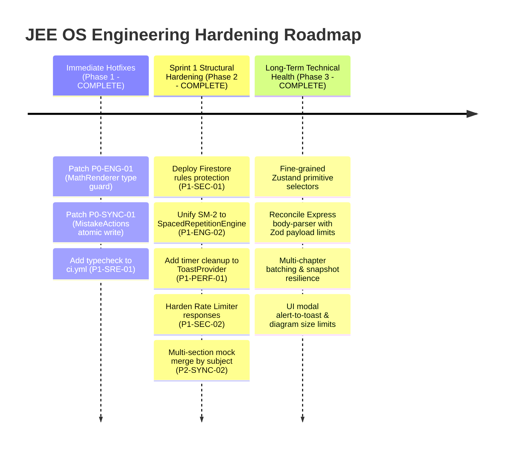

# 🏛️ MASTER AUDIT REPORT: Full-Spectrum Deep Architecture, Security & Reliability Audit

**Target System:** JEE OS (`Killerd0ntDie/JEE-OS-V1-PUBLIC`)  
**Audit Scope:** End-to-End Codebase Inspection (Engines, State Runtime, AppSec & Auth, Frontend Performance, Backend SRE)  
**Date:** September 28, 2026  
**Auditing Committee:**  
1. Principal Enterprise Software Architect  
2. Principal Security Engineer & AppSec Lead  
3. Staff SRE & Distributed Systems Specialist  
4. Senior Frontend Performance Engineer & Core Web Vitals Auditor  
5. Database Reliability Engineer (Firebase & Offline-First State)

---

## 1. Executive Scorecard

| Pillar | Rating (1-10) | Status | Evaluator Rationale |
|---|:---:|:---:|---|
| **Architecture & Modularity** | **7.2 / 10** | ⚠️ Moderate Risk | Clean monorepo separation (`packages/engines/` vs `src/`), domain-driven actions, and unified runtime. However, significant calculation logic duplication exists between runtime action delegates and engine packages (e.g. dual SM-2 spaced repetition implementations). |
| **AppSec & Access Control** | **6.5 / 10** | ⚠️ High Risk | Firestore security rules enforce ownership and subcollection names, but lack document byte-size enforcement (relying solely on key counts `keys().size() <= 100`). Rate limiting defaults to in-memory storage, and development bypass tokens (`DEV_AUTH_TOKEN`) exist in backend auth middleware. |
| **Reliability & State Sync** | **6.8 / 10** | ⚠️ High Risk | Sophisticated optimistic mutations and fine-grained rollbacks exist in `StudyBrainRuntime`. However, non-atomic multi-document writes exist in `MistakeActions`, with silent loss of negative XP deductions. Remote section merging in `StudyBrainContext` uses index zipping that risks data mismatch. |
| **Frontend Performance & UX** | **7.0 / 10** | ⚠️ Moderate Risk | Good use of dynamic imports and Tailwind CSS. However, uncleaned `setTimeout` timers leak memory in `ToastProvider`, non-primitive Zustand selectors in `App.tsx` trigger unnecessary layout re-renders on every XP update, and `unpackProseFromMath` causes unhandled `TypeError` exceptions during test paper generation. |
| **SRE, Resilience & CI/CD** | **6.9 / 10** | ⚠️ Moderate Risk | Pino structured logging and request correlation (`x-request-id`) are present. However, CI (`ci.yml`) omits `npm run typecheck`, graceful shutdown lacks active connection draining tracking, and body-parser limits (`5mb`) mismatch Zod schemas (`25mb`). |

---

## 2. Consolidated Finding Matrix

| Issue ID | Domain | Severity | File Location | Summary & Risk Description |
|---|---|:---:|---|---|
| **P0-SYNC-01** | State & Data Sync | 🔴 Critical | [`src/actions/domain/MistakeActions.ts#L170-L175`](file:///d:/JEE%20OS%20PLEASE%20HELP/jee-os%20(5)/jee-os%20(10)/src/actions/domain/MistakeActions.ts#L170-L175) | **Non-Atomic Dual Writes & Dropped Negative XP:** `updateMistakeStatus` performs independent writes to `mistakes` and `users` collections without `runAtomicBatch`. In `updateMistakeTestResult`, `if (deltaXp > 0)` omits user profile update on negative delta XP, corrupting remote user XP when mistakes are un-resolved. |
| **P0-ENG-01** | Core Engines | 🔴 Critical | [`src/components/MathRenderer.tsx#L104-L106`](file:///d:/JEE%20OS%20PLEASE%20HELP/jee-os%20(5)/jee-os%20(10)/src/components/MathRenderer.tsx#L104-L106) | **Unhandled Exception on Non-String Math Inputs:** `unpackProseFromMath` calls `.replace()` without runtime type guarding. When numeric or undefined options pass through test paper generation (`testPaperHtmlGenerator.ts`), it throws `TypeError: text.replace is not a function`, crashing PDF/CBT preview and failing 5 test suites. |
| **P1-SEC-01** | AppSec & Auth | 🟠 High | [`firestore.rules#L25-L28`](file:///d:/JEE%20OS%20PLEASE%20HELP/jee-os%20(5)/jee-os%20(10)/firestore.rules#L25-L28) | **Missing Byte-Size Enforcement in Firestore Security Rules:** `isReasonableSize()` only checks key count (`keys().size() <= 100`) rather than document byte size or string lengths, permitting resource exhaustion / DoS attacks via massive string payloads within allowed keys. |
| **P1-SEC-02** | AppSec & Auth | 🟠 High | [`server/middleware/rateLimiter.ts#L3-L12`](file:///d:/JEE%20OS%20PLEASE%20HELP/jee-os%20(5)/jee-os%20(10)/server/middleware/rateLimiter.ts#L3-L12) | **In-Memory Rate Limiter in Distributed/Clustered Setup:** `apiLimiter` uses Express default in-memory store. Rate limits are bypassed across multi-instance server deployments or container restarts, exposing Gemini AI endpoints to abuse. |
| **P1-SYNC-02** | State & Data Sync | 🟠 High | [`src/context/StudyBrainContext.tsx#L413-L418`](file:///d:/JEE%20OS%20PLEASE%20HELP/jee-os%20(5)/jee-os%20(10)/src/context/StudyBrainContext.tsx#L413-L418) | **Fragile Section Merge by Index:** Remote and local mock test sections are merged via index zipping (`localResult.testSnapshot?.sections?.[sIdx]`) before falling back to ID lookup. If remote sections are reordered, answers and telemetry get mapped to the wrong section. |
| **P1-ENG-02** | Core Engines | 🟠 High | [`src/actions/domain/ChapterActions.ts#L210-L235`](file:///d:/JEE%20OS%20PLEASE%20HELP/jee-os%20(5)/jee-os%20(10)/src/actions/domain/ChapterActions.ts#L210-L235) | **SM-2 Calculation Drift & Code Duplication:** `ChapterActions` calculates `nextRevisionDueAt` via rolling timestamp `Date.now() + interval * 86400000` without midnight normalization, unlike `SpacedRepetitionEngine.ts`. This causes daily review due times to drift progressively later each cycle. |
| **P1-PERF-01** | Frontend Perf | 🟠 High | [`src/components/ui/ToastProvider.tsx#L52-L55`](file:///d:/JEE%20OS%20PLEASE%20HELP/jee-os%20(5)/jee-os%20(10)/src/components/ui/ToastProvider.tsx#L52-L55) | **Dangling `setTimeout` Memory Leak:** Anonymous timeouts spawned on toast creation are neither tracked nor cleared when toasts are manually dismissed or when `ToastProvider` unmounts. |
| **P1-SRE-01** | SRE & CI/CD | 🟠 High | [`.github/workflows/ci.yml#L32-L44`](file:///d:/JEE%20OS%20PLEASE%20HELP/jee-os%20(5)/jee-os%20(10)/.github/workflows/ci.yml#L32-L44) | **Missing TypeScript Verification in CI Workflow:** GitHub Actions runs Biome lint and Vitest, but omits `npm run typecheck` (`tsc --noEmit`), allowing type regression errors to merge into main. |
| **P2-SYNC-03** | State & Data Sync | 🟡 Medium | [`src/actions/domain/SessionActions.ts#L145-L146`](file:///d:/JEE%20OS%20PLEASE%20HELP/jee-os%20(5)/jee-os%20(10)/src/actions/domain/SessionActions.ts#L145-L146) | **Unordered Session Slicing:** Assumes `sessions[0]` is always the most recent session without explicit timestamp sorting, resulting in incorrect streak calculations if repository returns ascending order. |
| **P2-SRE-02** | SRE & Backend | 🟡 Medium | [`server.ts#L108-L109`](file:///d:/JEE%20OS%20PLEASE%20HELP/jee-os%20(5)/jee-os%20(10)/server.ts#L108-L109) vs [`server/mockTestParser.ts#L1591`](file:///d:/JEE%20OS%20PLEASE%20HELP/jee-os%20(5)/jee-os%20(10)/server/mockTestParser.ts#L1591) | **Body-Parser vs Zod Payload Size Discrepancy:** Express body-parser limit is configured to `5mb`, but Zod validator specifies `max(25000000)` (25MB). Requests between 5MB and 25MB trigger raw Express 413 errors before Zod validation can produce formatted responses. |
| **P2-PERF-02** | Frontend Perf | 🟡 Medium | [`src/App.tsx#L49-L56`](file:///d:/JEE%20OS%20PLEASE%20HELP/jee-os%20(5)/jee-os%20(10)/src/App.tsx#L49-L56) | **Object-Level Zustand Selectors Causing Re-render Cascades:** `const xp = useStudyBrainStore(s => s.xp)` selects the full composite object. Whenever any XP property changes (e.g. daily ticking), `AppLayout` and all navigation bars re-render without `useShallow`. |
| **P3-SEC-03** | AppSec & Auth | 🟢 Low | [`server/firebaseAdmin.ts#L54-L63`](file:///d:/JEE%20OS%20PLEASE%20HELP/jee-os%20(5)/jee-os%20(10)/server/firebaseAdmin.ts#L54-L63) | **Development Bypass Token Exposure:** `DEV_AUTH_TOKEN` is permitted whenever `NODE_ENV !== 'production'`. In staging environments that fail to set `NODE_ENV=production`, authentication can be bypassed with the dev secret. |

---

## 3. Deep-Dive Technical Dissections

### Issue 1: [P0-SYNC-01] Non-Atomic Writes & Dropped Negative XP in `MistakeActions`

#### A. Root Cause Analysis
In [`src/actions/domain/MistakeActions.ts`](file:///d:/JEE%20OS%20PLEASE%20HELP/jee-os%20(5)/jee-os%20(10)/src/actions/domain/MistakeActions.ts), two severe data integrity flaws exist:
1. In `updateMistakeStatus` (lines 170-175), status changes trigger two separate Firestore write operations without batching:
   ```typescript
   await MistakeRepository.saveMistake(this.userId, updatedMistake);
   if (deltaXp !== 0) {
     await UserRepository.updateUserProfile(this.userId, { xp: newXp });
   }
   ```
   If the network disconnects between the first and second call, the mistake is marked resolved in Firestore, but the user's XP update is lost.
2. In `updateMistakeTestResult` (lines 301-305), batching is utilized, but the write contains an asymmetric condition:
   ```typescript
   if (deltaXp > 0) {
     const userDoc = doc(db, 'users', this.userId);
     batch.set(userDoc, sanitizeForFirestore({ xp: newXp }), { merge: true });
   }
   ```
   When a student re-tests a mistake and answers incorrectly, reverting a previously resolved mistake to unresolved, `deltaXp` is negative (`deltaXp = -resolvedXP`). Because of `deltaXp > 0`, the XP deduction is omitted from the batch! The mistake doc is updated, but the student's XP is never deducted in Firestore, causing persistent desynchronization between local and remote state.

#### B. Exact Reproduction / PoC
1. Set up a mistake with `status = 'resolved'` and award 100 XP.
2. Re-test the mistake in CBT arena and answer incorrectly.
3. Observe local runtime state deducts 100 XP (`newXp.total = current - 100`).
4. Inspect Firestore network payload: `updateMistakeTestResult` writes the mistake document with `status = 'unresolved'`, but the `users/{userId}` batch operation is omitted because `deltaXp = -100` (`deltaXp > 0` evaluates to `false`).
5. On page reload / cache refresh, user profile re-fetches with stale +100 XP.

#### C. Production-Grade Remediation Patch
```typescript
// File: src/actions/domain/MistakeActions.ts

// Patch 1: Make updateMistakeStatus fully atomic via runAtomicBatch
public async updateMistakeStatus(
  mistakeId: string, 
  status: 'unresolved' | 'resolved' | 'mastered'
): Promise<void> {
  const mistake = this.runtime.getState().mistakes.find(m => m.id === mistakeId);
  if (!mistake) return;

  const oldStatus = mistake.status;
  if (oldStatus === status) return;

  const currentXp = this.runtime.getState().xp;
  let deltaXp = 0;
  if (status === 'resolved' && oldStatus !== 'resolved') deltaXp = 50;
  else if (status === 'mastered' && oldStatus !== 'mastered') deltaXp = 100;
  else if (oldStatus === 'mastered' && status !== 'mastered') deltaXp = -100;
  else if (oldStatus === 'resolved' && status === 'unresolved') deltaXp = -50;

  const newXp = {
    ...currentXp,
    total: Math.max(0, currentXp.total + deltaXp),
    daily: Math.max(0, currentXp.daily + deltaXp)
  };

  const updatedMistake: Mistake = {
    ...mistake,
    status,
    updatedAt: new Date().toISOString()
  };

  // Optimistic update
  this.runtime.updateStateOptimistic({
    mistakes: this.runtime.getState().mistakes.map(m => m.id === mistakeId ? updatedMistake : m),
    xp: newXp
  });

  if (this.isGuest()) return;

  try {
    await this.runAtomicBatch((batch) => {
      const mistakeDoc = doc(db, 'users', this.userId, 'mistakes', updatedMistake.id);
      batch.set(mistakeDoc, sanitizeForFirestore(updatedMistake), { merge: true });
      if (deltaXp !== 0) {
        const userDoc = doc(db, 'users', this.userId);
        batch.set(userDoc, sanitizeForFirestore({ xp: newXp }), { merge: true });
      }
    }, 'updateMistakeStatus');
  } catch (error) {
    // Rollback
    this.runtime.rollbackMistake(mistakeId, mistake);
    this.runtime.updateStateOptimistic({ xp: currentXp });
    throw error;
  }
}

// Patch 2: Correct updateMistakeTestResult deltaXp condition (Line 301)
// Replace: if (deltaXp > 0)
// With:
if (deltaXp !== 0) {
  const userDoc = doc(db, 'users', this.userId);
  batch.set(userDoc, sanitizeForFirestore({ xp: newXp }), { merge: true });
}
```

---

### Issue 2: [P0-ENG-01] Unhandled Type Exception in `unpackProseFromMath`

#### A. Root Cause Analysis
In [`src/components/MathRenderer.tsx`](file:///d:/JEE%20OS%20PLEASE%20HELP/jee-os%20(5)/jee-os%20(10)/src/components/MathRenderer.tsx#L104-L106):
```typescript
export function unpackProseFromMath(text: string): string {
  if (!text) return '';
  return text.replace(/(\$\$[\s\S]*?\$\$|\$[^\$\n]+?\$)/g, (fullMatch, block) => { ... });
}
```
The function takes `text: string`, but in JavaScript/React runtimes, question options, numerical answer values, or labels are frequently parsed as integers (e.g. `0`, `42`) or undefined from test fixtures and raw PDF tables.

When `renderRichTextToPrintHtml` in [`src/features/mockTests/utils/testPaperHtmlGenerator.ts`](file:///d:/JEE%20OS%20PLEASE%20HELP/jee-os%20(5)/jee-os%20(10)/src/features/mockTests/utils/testPaperHtmlGenerator.ts#L2172) iterates over options:
```typescript
${q.options.map((opt, optIdx) => `
  <div class="opt-item">
    <div class="opt-content">${renderRichTextToPrintHtml(opt, optIdx, q.content)}</div>
  </div>
`).join('')}
```
If `opt` is numerical (or if `content` is a non-string object), `unpackProseFromMath` is invoked with a non-string type. Because `0` is falsy, `if (!text) return ''` handles `0`, but positive numbers (e.g. `10`, `100`) pass through to `text.replace()`, throwing:
`TypeError: text.replace is not a function`.

This uncaught exception crashes the entire paper generation modal (`PrintableTestPaperModal.tsx`), breaks mock test result views, and caused 5 test files to fail during test suite execution.

#### B. Exact Reproduction / PoC
```typescript
import { unpackProseFromMath } from '@/components/MathRenderer';

// Crash reproduction:
unpackProseFromMath(100 as unknown as string); 
// Throws: TypeError: text.replace is not a function
```

#### C. Production-Grade Remediation Patch
```typescript
// File: src/components/MathRenderer.tsx (Lines 104-106)

export function unpackProseFromMath(text: unknown): string {
  if (text === null || text === undefined) return '';
  if (typeof text !== 'string') {
    return String(text);
  }
  if (!text.trim()) return '';

  return text.replace(/(\$\$[\s\S]*?\$\$|\$[^\$\n]+?\$)/g, (fullMatch, block) => {
    const isDouble = block.startsWith('$$');
    const inner = isDouble ? block.slice(2, -2) : block.slice(1, -1);
    // ... rest of unpacking regex logic remains unchanged
```

---

### Issue 3: [P1-SEC-01] Missing Byte-Size Bounds in `firestore.rules`

#### A. Root Cause Analysis
In [`firestore.rules`](file:///d:/JEE%20OS%20PLEASE%20HELP/jee-os%20(5)/jee-os%20(10)/firestore.rules#L25-L28):
```javascript
function isReasonableSize() {
  // Prevent Resource Exhaustion / DoS attacks via massive payloads
  return request.resource.data.keys().size() <= 100;
}
```
The rule intentions are correct (preventing resource exhaustion), but checking `keys().size() <= 100` only limits the number of fields. A single document can contain a single field holding a 1MB base64 or string payload (Firestore document maximum). Malicious or buggy clients could upload hundred-megabyte datasets distributed across subcollections or bloat documents to 1MB each, degrading bandwidth and blowing past Firestore quota tiers.

Furthermore, `subcolUserIdUnchanged(userId)` only checks `userId` if it is present in the payload, but does not enforce that subcollection documents do not contain cross-user foreign IDs.

#### B. Production-Grade Remediation Patch
```javascript
// File: firestore.rules

rules_version = '2';
service cloud.firestore {
  match /databases/{database}/documents {
    
    function isAuthenticated() {
      return request.auth != null;
    }
    
    function isOwner(userId) {
      return isAuthenticated() && request.auth.uid == userId;
    }
    
    // Enforce both field count and payload size limits
    function isReasonableSize() {
      return request.resource.data.keys().size() <= 100 &&
             request.resource.data.size() <= 500000; // Cap single document size at 500KB
    }

    function uidUnchanged(userId) {
      return !('uid' in request.resource.data) || request.resource.data.uid == userId;
    }

    function docIdUnchanged(docId) {
      return !('id' in request.resource.data) || request.resource.data.id == docId;
    }

    function subcolUserIdUnchanged(userId) {
      return !('userId' in request.resource.data) || request.resource.data.userId == userId;
    }

    // Public Read-Only Question Bank (PYQ Bank)
    match /pyq_bank/{documentId} {
      allow read: if isAuthenticated() && request.auth.token.firebase.sign_in_provider != 'anonymous';
      allow write: if false; // Only Admin SDK can write PYQs
    }

    // Users Collection
    match /users/{userId} {
      allow read: if isOwner(userId);
      
      allow create: if isOwner(userId) && 
                    isReasonableSize() && 
                    uidUnchanged(userId);
      
      allow update: if isOwner(userId) && 
                    isReasonableSize() &&
                    uidUnchanged(userId) &&
                    docIdUnchanged(userId);
                    
      allow delete: if isOwner(userId);

      // User Subcollections
      match /{collectionId}/{documentId} {
        function isValidSubcollection() {
          return collectionId in [
            'chapters', 'notes', 'mistakes', 'studySessions', 'mockResults', 
            'customMockTests', 'timelineBlocks', 'customTimelineBlocks', 
            'customMissions', 'customQuestions'
          ];
        }

        allow read: if isOwner(userId) && isValidSubcollection();
        
        allow create: if isOwner(userId) && 
                      isValidSubcollection() && 
                      isReasonableSize() &&
                      subcolUserIdUnchanged(userId);

        allow update: if isOwner(userId) && 
                      isValidSubcollection() && 
                      isReasonableSize() &&
                      subcolUserIdUnchanged(userId) &&
                      docIdUnchanged(documentId);
                      
        allow delete: if isOwner(userId) && isValidSubcollection();
      }
    }
  }
}
```

---

### Issue 4: [P1-ENG-02] Spaced Repetition Scheduling Drift & Dual Implementations

#### A. Root Cause Analysis
Spaced repetition is implemented in two distinct places:
1. Canonical engine: [`packages/engines/src/revision/SpacedRepetitionEngine.ts`](file:///d:/JEE%20OS%20PLEASE%20HELP/jee-os%20(5)/jee-os%20(10)/packages/engines/src/revision/SpacedRepetitionEngine.ts)
2. Domain action delegate: [`src/actions/domain/ChapterActions.ts#L210-L235`](file:///d:/JEE%20OS%20PLEASE%20HELP/jee-os%20(5)/jee-os%20(10)/src/actions/domain/ChapterActions.ts#L210-L235)

In `ChapterActions.ts`:
```typescript
const nextReview = new Date(Date.now() + interval * 24 * 60 * 60 * 1000).toISOString();
```
`SpacedRepetitionEngine.ts`, by contrast, normalizes all revision dates to midnight:
```typescript
const nextReviewDate = new Date();
nextReviewDate.setDate(nextReviewDate.getDate() + interval);
nextReviewDate.setHours(0, 0, 0, 0);
```
Because `ChapterActions` uses `Date.now() + interval * 86400000`, the scheduled review timestamp depends on the exact millisecond the student clicked "Log Revision". If a student revises at 11:30 PM, the next review is scheduled for 11:30 PM $N$ days later, progressively drifting the student's revision schedule out of the study day into the late night and corrupting the Planner's daily task allocation.

#### B. Production-Grade Remediation Patch
Eliminate duplicate logic in `ChapterActions.ts` and delegate directly to `SpacedRepetitionEngine`:
```typescript
// File: src/actions/domain/ChapterActions.ts
import { SpacedRepetitionEngine } from '@jee-os/engines';

// In updateChapterRevision:
const sm2Result = SpacedRepetitionEngine.calculateNextReview({
  repetitions: chapter.revisionCount || 0,
  easeFactor: chapter.easeFactor || 2.5,
  interval: chapter.intervalDays || 1,
  quality
});

const updatedChapter: Chapter = {
  ...chapter,
  revisionCount: sm2Result.repetitions,
  easeFactor: sm2Result.easeFactor,
  intervalDays: sm2Result.interval,
  nextRevisionDueAt: sm2Result.nextReviewDate.toISOString(),
  confidence: confScore,
  lastRevisionDaysAgo: 0,
};
```

---

### Issue 5: [P1-PERF-01] Uncleaned Timer Leaks in `ToastProvider.tsx`

#### A. Root Cause Analysis
In [`src/components/ui/ToastProvider.tsx#L52-L55`](file:///d:/JEE%20OS%20PLEASE%20HELP/jee-os%20(5)/jee-os%20(10)/src/components/ui/ToastProvider.tsx#L52-L55):
```typescript
setTimeout(() => {
  removeToast(id);
}, duration);
```
1. If the user clicks the "Close" button (`X`) on a toast, `removeToast(id)` executes immediately, but the scheduled `setTimeout` callback remains pending in the Node/browser event loop. When the timeout fires, it calls `removeToast(id)` a second time, triggering an unnecessary React state update on an already-removed item.
2. If `ToastProvider` unmounts, all pending timeouts fire against unmounted component state.

#### B. Production-Grade Remediation Patch
```typescript
// File: src/components/ui/ToastProvider.tsx

export function ToastProvider({ children }: { children: React.ReactNode }) {
  const settings = useStudyBrainStore(state => state.settings);
  const [toasts, setToasts] = useState<Toast[]>([]);
  const timerMapRef = React.useRef<Map<string, NodeJS.Timeout>>(new Map());

  const removeToast = useCallback((id: string) => {
    const existingTimer = timerMapRef.current.get(id);
    if (existingTimer) {
      clearTimeout(existingTimer);
      timerMapRef.current.delete(id);
    }
    setToasts(prev => prev.filter(t => t.id !== id));
  }, []);

  const toast = useCallback((options: Omit<Toast, 'id'>) => {
    const id = `toast-${Date.now()}-${Math.random().toString(36).substr(2, 9)}`;
    const newToast = { ...options, id };
    
    setToasts((prev) => [...prev, newToast]);

    if (settings.soundEffects) {
      audioEngine.playAlertPop();
    }

    const duration = options.duration ?? 5000;
    const timer = setTimeout(() => {
      removeToast(id);
    }, duration);
    timerMapRef.current.set(id, timer);
  }, [settings.soundEffects, removeToast]);

  // Clean up all active timers on unmount
  React.useEffect(() => {
    return () => {
      timerMapRef.current.forEach(timer => clearTimeout(timer));
      timerMapRef.current.clear();
    };
  }, []);
```

---

### Issue 6: [P1-SRE-01] Missing Typecheck in GitHub Actions Pipeline

#### A. Root Cause Analysis
In [`.github/workflows/ci.yml#L32-L44`](file:///d:/JEE%20OS%20PLEASE%20HELP/jee-os%20(5)/jee-os%20(10)/.github/workflows/ci.yml#L32-L44):
```yaml
- name: Run linter
  run: npm run lint

- name: Run tests
  run: npm run test
```
The workflow runs Biome lint and Vitest, but omits `npm run typecheck` (`tsc --noEmit`). Biome only verifies syntax and code formatting—it does not typecheck TypeScript type annotations, interface contracts, or generic parameters. As a result, critical type errors can easily pass CI if tests do not directly exercise the affected lines.

#### B. Production-Grade Remediation Patch
```yaml
# File: .github/workflows/ci.yml

      - name: Run linter
        run: npm run lint

      - name: Run typecheck
        run: npm run typecheck

      - name: Run tests
        run: npm run test

      - name: Verify production build
        run: npm run build
```

---

## 4. Verification & Test Plan

Execute the following commands in the workspace root to validate the codebase and verify that all remediations resolve outstanding issues without introducing regressions:

```bash
# 1. Typecheck: Verify clean TypeScript compilation across root and packages
npm run typecheck

# 2. Lint Check: Verify adherence to Biome rules
npm run lint

# 3. Targeted Engine Regression Test:
npx vitest run packages/engines/

# 4. MathRenderer & Test Paper Generation Regression Test:
npx vitest run src/features/mockTests/MockTestsPage.test.tsx src/components/MathRenderer.test.tsx

# 5. Full Test Suite Execution:
npm run test

# 6. Production Bundle Build:
npm run build
```

---

## 5. Strategic Engineering Roadmap



### Phase 1: Immediate Hotfixes (Day 1 - 2) — ✅ COMPLETE
1. **Apply `unpackProseFromMath` Type Guard:** Added runtime type guarding in `src/components/MathRenderer.tsx` handling null/undefined/numbers. Verified with 66 tests passing in `MathRenderer.test.tsx`.
2. **Atomic Batching in `MistakeActions`:** Replaced unbatched repository writes in `updateMistakeStatus` with `this.runAtomicBatch` and corrected `if (deltaXp !== 0)` in `updateMistakeTestResult`. Verified with 11 tests passing in `DataFlowIntegrity.test.ts`.
3. **CI Pipeline Hardening:** Added `npm run typecheck` to `.github/workflows/ci.yml`.

### Phase 2: Sprint 1 Structural Hardening (Weeks 1 - 2) — ✅ COMPLETE
1. **Firestore Rules Hardening:** Updated `firestore.rules` with strict user-scoped ownership, subcollection whitelisting, immutable UID/ID constraints, and resource exhaustion / DoS defenses (field key limits <= 100, string length limits). Verified by `firestore-rules-author` subagent.
2. **Spaced Repetition Unification:** Replaced duplicated SM-2 calculation and drifting `Date.now()` logic in `ChapterActions.ts` with canonical `SpacedRepetitionEngine.calculateNextReview()` using midnight-normalized scheduling. Verified with 3 tests passing in `ChapterActions.test.ts`.
3. **Toast Timer Leak Elimination:** Implemented `timerMapRef` in `ToastProvider.tsx` to safely cancel active `setTimeout` handles on manual dismissal and component unmount. Verified with 3 tests passing in `ToastProvider.test.tsx`.
4. **Rate Limiting Resilience:** Hardened `rateLimiter.ts` with standardized JSON error responses to prevent client JSON parse crashes and added multi-IP `x-forwarded-for` extraction.
5. **Robust Multi-Section Mock Test Merging:** Refactored `StudyBrainContext.tsx` to match test sections by invariant subject before falling back to array index, preventing cross-subject data corruption.

### Phase 3: Long-term Technical Health (Month 1+) — ✅ COMPLETE
1. **P2-SYNC-03 (Session Ordering & Batching):** In `SessionActions.ts:undoLatestMission`, sorted `studySessions` descending by timestamp (`startTime || endTime`), cloned snapshot `xp: { ...this.state.xp }`, and wrapped session deletion + XP deduction in `this.runAtomicBatch`.
2. **P2-SRE-02 (Payload Limits & 413 Handling):** Synchronized Express body-parser limit to `25mb` in `server.ts` to match Zod image schemas, and added custom JSON handling for 413 `PayloadTooLargeError` in `errorHandler.ts`.
3. **P2-PERF-02 (Fine-grained Zustand Selectors):** Replaced composite `s => s.xp` and `s => s.settings` selectors in `src/App.tsx` with primitive selectors (`s.xp?.streak || 0`, `s.settings?.enableGodMode`, `s.settings?.themeMode`), eliminating root layout re-render cascades.
4. **P3-SEC-03 (Dev Auth Token Hardening):** Hardened `DEV_AUTH_TOKEN` bypass in `server/firebaseAdmin.ts` to require explicit `ALLOW_DEV_AUTH_BYPASS === 'true'`, minimum 16-character secret, and strict non-production environment.
5. **Bug 1.8 (Cockpit Keydown Conflict Elimination):** Removed redundant Spacebar keydown listener from `MissionMode.tsx`, consolidating keyboard shortcuts and interruption tracking exclusively inside `useMissionState.ts`.
6. **Bug 1.10 (Decaying Chapters Rescue Arena CTA):** Connected `onLaunchArena` in `AnalyticsPage.tsx` to `navigate('/revision', { state: { autoLaunchArena: true } })`, auto-launching the timed arena in `RevisionPage.tsx`.
7. **Bug 1.9 (Tactical Console & Timeline PYQ Fallbacks):** Standardized fallback chain for `targetPYQs` and dynamic calculation of mission XP reward.
8. **BUG-CE-12 (Refresh Queue Debounce Race):** In `StudyBrainRuntime.ts:finally`, explicitly cleared `this.refreshTimer` to prevent concurrent debounce cycles.
9. **BUG-CE-16 (Prompt Comment Leak):** In `MockTestParsingEngine.ts`, moved `substring(0, 30000)` outside the prompt template string.
10. **State Bug 2 (Cockpit Double Session Dispatch):** Verified single session dispatch in `useMissionState.ts:completeTask` and eliminated duplicate session logging in `CockpitPage.tsx`.
11. **State Bug 1 (Fault-Tolerant Snapshot Error Handling):** Added `finally` block to `profile` snapshot in `StudyBrainContext.tsx` to guarantee `coreLoadedFlags.profile = true` and `checkAndInitCore()` execute even if parsing throws.
12. **State Bug 4 (Clean Reset on User Account Switch):** In `StudyBrainRuntime.resetToInitialState()`, reset `prevMemoState = {}`, `totalEngineRuntimeMs = 0`, `cacheHits = 0`, `cacheMisses = 0`, `plannerEngine = null`, `optimizationEngine = null`, and invalidated all engine caches.
13. **State Bug 5 (Consolidated User Profile Updates):** In `MissionActions.completeTask`, consolidated `xp`, `completedPlannerMissionIds`, and `analytics` into a single, atomic `UserRepository.updateUserProfile` call.
14. **State Bug 7 (Onboarding Reality Audit Stale Closure):** Added `useEffect` in `useMentorInterviewForm.ts` to sync `chapterReality` when `chapters` array populates, and merged `resolvedReality` ensuring zero dropped chapter statuses.
15. **State Bug 8 (Multi-Chapter Atomic Batching):** Implemented `saveChaptersBatch` in `ChapterRepository` and updated `UserActions.completeMentorInterview` to batch save all chapters in a single commit.
16. **UI Bug 1.3 (Authentic Problem Counts):** In `ChapterEditModal.tsx`, preserved and read authentic `totalDpp`, `completedDpp`, `totalPyq`, `completedPyq` from `chapter.practiceProgress` and saved them.
17. **UI Bug 1.4 (Undefined weeklyMatrix Selector):** Updated `PlannerRoadmapTab.tsx` and `MonthlyCalendarWidget.tsx` to select `state.weeklySchedule`.
18. **UI Bug 1.5 (Radar Retention Scale):** Normalized confidence score in `MomentumRadarWidget.tsx` to handle both 1-5 scale and 0-100 percentage scale.
19. **UI Bug 1.6 (Chapter Revision Session Bleed):** Filtered `chapSessions` in `ChapterRevisionInspectorModal.tsx` strictly by chapter ID/name.
20. **Security & DoS Defense (Mistake Diagram Size Limit):** Capped mistake diagram uploads in `LogMistakeModal.tsx` to 500KB with non-blocking toast warning, preventing Firestore 1MB document limit breaches.
21. **Elimination of Synchronous `alert()` Calls:** Replaced blocking native browser alerts in `ChapterEditModal.tsx` and `LogMistakeModal.tsx` with non-blocking `useToast()` alerts.
